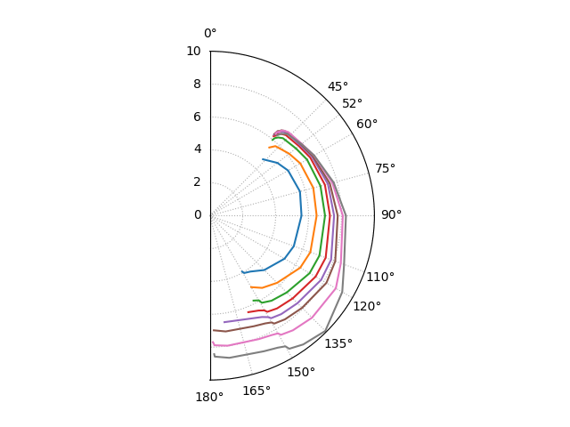

# X-332 Target Speeds

Play with averaged speeds, beat and run angles.

## Example

## Data Sources

 - https://forums.sailinganarchy.com/threads/x332-polar-table-or-diagram.52100/
 - https://jieter.github.io/orc-data/site/index.html#extremes
 - https://www.blur.se/boats/
   - https://blur.se/polar/x332_polar.txt